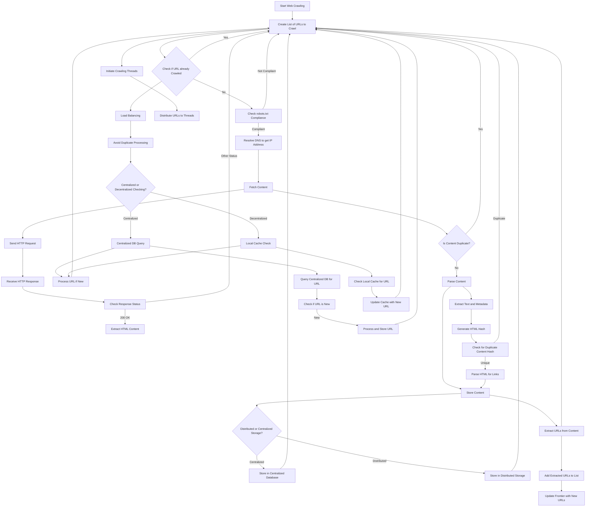

# Web Crawler

This repo contains code for a web crawler which is based on the following approach, this architecture was built using mermaid.js, this architecture employees caching as per as respects robots.txt to follow compliance requirements for the hosts, which we'll try to crawl from our crawler which was built using python3.



# How to handle scale in this application?

- We can use Google Cloud Storage (GCS) to scale our architecture and allow it to support billions of URLs

- We can use GCS for storing fetched content by creating GCS buckets.

- We can use Google Cloud Tasks for the message queue to manage URLs to be crawled.

- We can then use Google Kubernetes Engine (GKE) to build background workers which takes the responsibility of crawling multiple websites.

- Similarly, Google Cloud Bigtable can be used for distributed storage of metadata and crawled URLs.

- We can use cloud DNS for DNS resolution,

- Similarly, we can employ Cloud Functions for microservices like robots.txt compliance check.

- We can replace local redis based cache to use google loud memorystore, for Redis for caching and deduplication.

- Finally, we can use Cloud Logging and Monitoring to track performance and errors by instrumentation the entire application and draining logs on stackdriver.


# Sample Output

```
mayanksingh@4290 Crawler % python3 crawler.py
URL disallowed by robots.txt: https://facebook.com/incomeinsider.org
URL disallowed by robots.txt: https://twitter.com/incomeinsider
URL already crawled: https://incomeinsider.org
URL disallowed by robots.txt: https://facebook.com/incomeinsider.org
URL disallowed by robots.txt: https://twitter.com/incomeinsider
URL disallowed by robots.txt: https://eddyballe.com/
```
